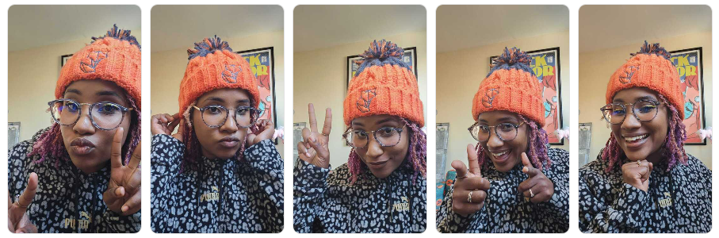

### Hi there 👋

Thee Python Community Advocate @ Microsoft

 
*(on occupied territory of the Lenape people)*
|Mastodon| Twitch | Chat with me | Blog |
|----|----|----|----|
| [@BajoranEngineer@mastodon.online](https://mastodon.online/@BajoranEngineer)| [Trek Tuesdays & Wagtail Wednesdays](https://twitch.tv/BajoranEngineer)  | [Python Microsoft Discord](https://aka.ms/python-discord)| [dawnwages.info/bajoran-engineer/](https://dawnwages.info/bajoran-engineer/)

I am a Django Software Engineer turned Product/Community manager. My corporate overlords let me work on the very _coolest_ of projects including, but not limited to: `Python on VS Code`, `Dev Containers`, [`hosting a monthly Python live stream called The Python Pulse`](https://www.youtube.com/playlist?list=PLj6YeMhvp2S4aIxuGH0NaGXQZlVUBsH3E), `Deploying Django on Azure`. 

## Upcoming conferences
- [DjangoCon EU 2024](https://2024.djangocon.us) Speaker
- [PyCon Nigeria 2024](https://ng.pycon.org/) Keynote speaker

## Stream Schedule

## 🔭 I’m currently working on...
- [Python Software Foundation](https://github.com/python/) Treasurer 
- [Anti Racist](https://attheroot.dev) and [Ethical Source](https://ethicalsource.dev/) License Advocate
- [Wagtail CMS](https://github.com/wagtail/wagtail) Core Team Member
- [Djangonaut Space](https://github.com/djangonaut-space) peer mentorship ring admin
- check out the rest at [dawnwages.info](https://dawnwages.info)
<!--
**dawnwages/dawnwages** is a ✨ _special_ ✨ repository because its `README.md` (this file) appears on your GitHub profile.

Here are some ideas to get you started:

- 🔭 I’m currently working on ...
- 🌱 I’m currently learning ...
- 👯 I’m looking to collaborate on ...
- 🤔 I’m looking for help with ...
- 💬 Ask me about ...
- 📫 How to reach me: ...
- 😄 Pronouns: ...
- ⚡ Fun fact: ...
-->
